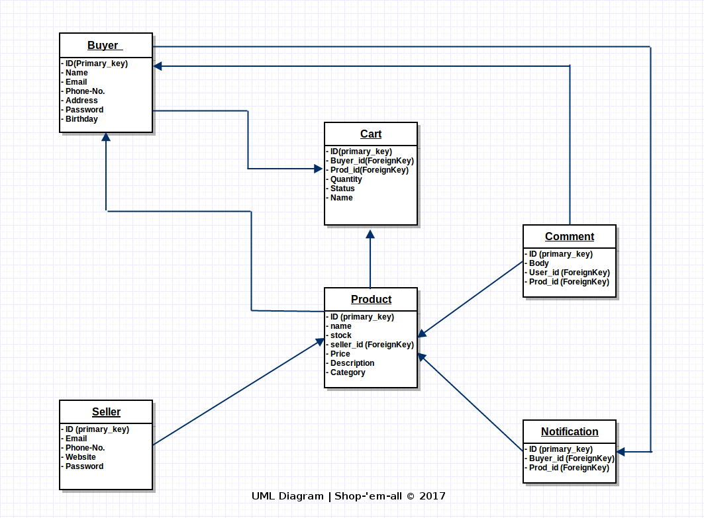

# Shopping Portal
Simple E-Commerce shopping portal using Flask.

## Authors
-----------

- [Utkarsh] (https://github.com/obliviateandsurrender) (utkarshazad98@gmail.com)
- [Kanay Gupta] (https://github.com/kanaygupta) (kanaygupta@gmail.com)
- [Nikhil Bansal] (https://github.com/nikhil3456/) (nikhilbansal3456@gmail.com)

## UML
-------
* Component Diagram 

## Setup Instructions

As the project is based on python3, user must have **pip3** installed.

### Dependencies
------------------
* Create a virtualenv called `env` and activate it.
* `pip3 install -r requirements.txt` # Install python dependencies

### Execution
------------------
* `python3 server.py` #run the server
* Visit the requested host using a latest chrome (>= v57.0.2987.133) or firefox (>= v52.0.2) browser. 